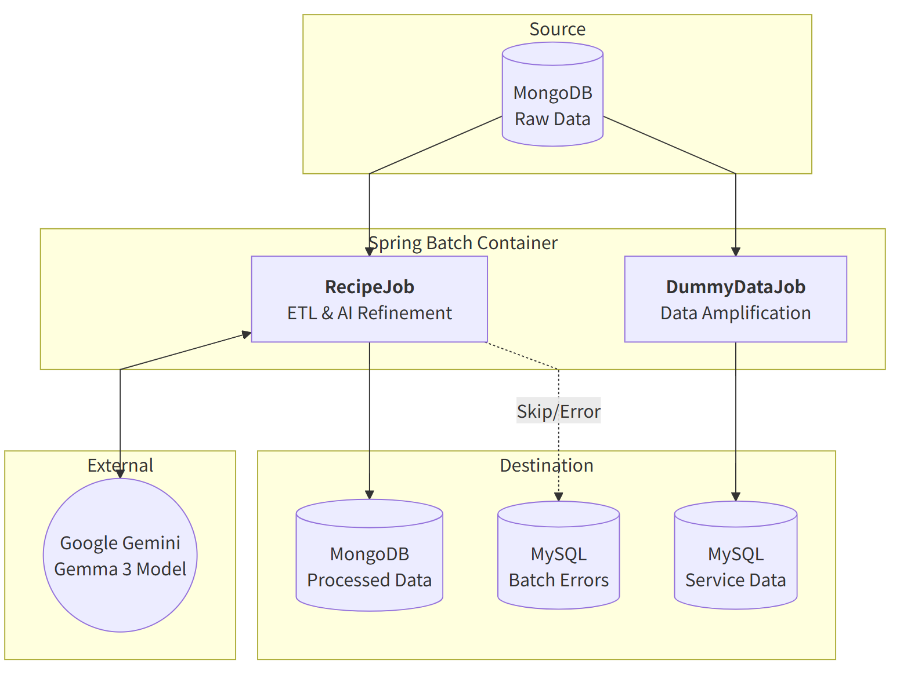

# Spring Batch 서버

- 본 프로젝트는 대규모 레시피 데이터를 정제 Job, 더미데이터 Job 등을 구현한 프로젝트

## 프로젝트 주요 구조



## Job 별 주요 구현 내용

### RecipeJob

원본 레시피 데이터(크롤링 데이터)의 불완전성을 Gemini AI(Gemma 3)로 보완하고 구조화된 데이터로 정제

#### Reader: `MongoPagingItemReader`

- **구현**:  흔히 사용하는 Offset 방식(`skip`, `limit`), 커서 방식 대신 **No-Offset(Keyset)** 방식을 구현
  - **Gemma3**모델(무료 모델) 특성 상 요청 term 을 가져야 하므로
  - **ExecutionContext** 이용 구현
- **performance**: 마지막 처리된 `_id`를 기준으로 인덱스 스캔(`gt`)을 수행하여 데이터 양이 늘어나도 조회 속도가 일정하게 유지
- **Chunk 전략**: DB 조회는 효율을 위해 100개(`PAGE_SIZE`)씩 수행하지만, Processor로는 2개(`PAIR_SIZE`)씩 전달하여 AI 모델의 Context Window 효율 최적화

#### Processor: `GeminiRecipeProcessor`

- **Logic**: 2개의 레시피를 하나의 프롬프트로 병합 처리하여 API 호출 비용 최적화
- Gemma 3 모델의 Rate Limit(무료 제한)을 준수하기 위해 처리 로직 내에 `Thread.sleep`을 적용, 안정적인 파이프라인을 구축

#### Writer: `MongoRecipeWriter`

- Chunk로 넘어온 데이터 뭉치를 Stream 처리

```java
  // 실제 구현 로직 요약
  chunk.getItems().stream()
       .flatMap(List::stream)      // 중첩 리스트 평탄화
       .filter(this::isValidRecipe) 
       .collect(Collectors.toList());
```

- **Validation**: 필수 필드 누락 여부를 필터링, 데이터 무결성을 검사 후 MongoDB 적재

---

### 2. DummyDataJob: 부하 테스트 대비 데이터 적재

단일 레시피를 기반으로 수십만 건의 부하테스트 용 더미 데이터(Post, Member, Comment)를 생성

#### Step 1: `InitStep` (Tasklet)

- **사전 데이터 준비**: `DummyDataProcessor`가 의존하는 메타 데이터(Member, Category, Tag)가 DB에 없을 경우 조건부 생성, 테스트 환경을 초기화

#### Reader: `MongoCursorItemReader`

- **커서 방식 채용**: DB 커서를 유지한 채 한 건씩 스트리밍(Streaming) 방식으로 읽음.
  - oom 방지 위해

#### Processor: `DummyDataProcessor`

- **캐싱 처리**: `ItemStream.open()` 시점에 자주 사용되는 메타 데이터(Category, Tag, Member)를 메모리에 캐싱 반복적 I/O 제거
- **비지니스 로직**: 1개의 Recipe에 포함된 **각 조리 순서(Step)마다 100개씩** Post를 생성하여 대량의 데이터로 증폭 반환 (1 Input -> N * 100 Outputs)

#### Writer: `DummyDataWriter`

- **Batch Save**: 병합된 리스트를 JPA `saveAll()`로 일괄 저장하여 DB 커넥션 오버헤드를 감소
- Post 저장 후 생성된 ID를 활용, 연관 테이블(PostTag) 데이터까지 동일 트랜잭션 내에서 처리

---

## 기술 스택

| Category            | Technology                  | Usage                                        |
| :------------------ | :-------------------------- | :------------------------------------------- |
| **Batch Framework** | **Spring Batch 5**          | Job/Step 구성, Chunk 프로세싱, 트랜잭션 관리 |
| **Language**        | **Java 17**                 |                                              |
| **Database**        | **MongoDB / MySQL**         | NoSQL(Raw Data) & RDBMS(Relational Data)     |
| **AI**              | **Google Gemini (Gemma 3)** | 자연어 처리를 통한 비정형 데이터 정제        |
| **Infra**           | **Docker & Compose**        | 컨테이너 기반의 격리된 실행 환경             |

---

## Docker & Deployment

멀티 스테이지 빌드 전략 사용

1. **Build Stage**: JDK 17 & Gradle 캐시를 활용한 컴파일 및 빌드
2. **Run Stage**: JRE 17 기반의 경량화된 런타임 이미지 생성
3. `logs` 볼륨 마운트 및 외부 네트워크(`blog-network`) 설정

---

## 예외 처리 및 스킵 전략

- **Skip Policy**: 일시적인 API 오류나 데이터 포맷 문제 발생 시, 배치 전체를 중단하지 않고 해당 Item만 Skip 처리.
- **에러 처리 전략**: 비즈니스 에러 로그 테이블 개별 운용
  - 관심사의 분리 분리 위해
    - 프레임워크의 실행 이력과 비즈니스 데이터의 결함(Domain)을 분리하여 데이터 및 테이블의 정체성 유지.